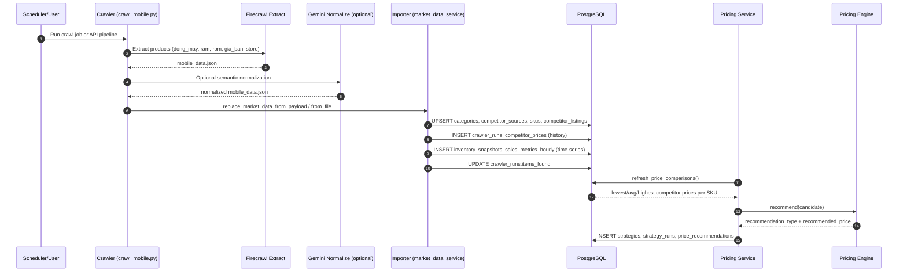
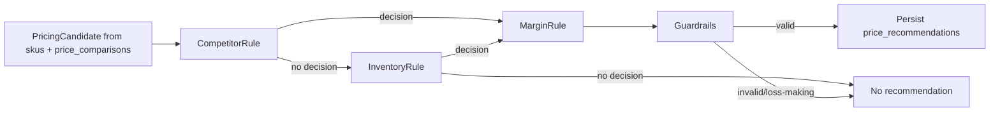

# GePricing — Rule-based Pricing Engine

> An e-commerce pricing system that crawls competitor prices, applies configurable business rules, and surfaces price recommendations through an admin UI with an approval workflow.

---

## Architecture Overview

```
                         LOCAL DEVELOPMENT (No Docker)
┌────────────────────────────────────────────────────────────────────┐
│                                                                    │
│  ┌──────────────┐         REST/JSON     ┌──────────────────────┐  │
│  │   Frontend   │◄──────────────────────►│    FastAPI (API)     │  │
│  │ React + TS   │   http://localhost:    │  :8000               │  │
│  │ TailwindCSS  │   5173                 │  Uvicorn (reload)    │  │
│  │   :5173      │                        │  CORS enabled        │  │
│  └──────────────┘                        │                      │  │
│   (npm run dev)                          │  Routers:            │  │
│                                          │  /skus, /pricing,    │  │
│                                          │  /approvals          │  │
│                                          └──────────┬───────────┘  │
│                                                     │               │
│                        ┌────────────────────────────┼──────────┐   │
│                        │                            │          │   │
│                        ▼                            ▼          │   │
│        ┌────────────────────────┐    ┌──────────────────────┐│   │
│        │  Pricing Engine        │    │  Redis (localhost)   ││   │
│        │  (Python module)       │    │  :6379               ││   │
│        │                        │    │  Cache price_recs    ││   │
│        │  Rules:                │    │  TTL: 5 min          ││   │
│        │  • MarginRule          │    └──────────────────────┘│   │
│        │  • CompetitorRule      │                            │   │
│        │  • InventoryRule       │                            │   │
│        │  • GuardrailsEngine    │                            │   │
│        └────────┬───────────────┘                            │   │
│                 │                                            │   │
│                 ▼                                            │   │
│    ┌────────────────────────┐    ┌────────────────────────┐ │   │
│    │   Crawler              │───►│  PostgreSQL (localhost)│ │   │
│    │  (Python process)      │    │  :5432                 │ │   │
│    │                        │    │  DB: gepricing_db      │ │   │
│    │  Runs every 30 min:    │    │  Tables:               │ │   │
│    │  • TGDD                │    │  • skus                │ │   │
│    │  • CellphoneS          │    │  • competitor_prices   │ │   │
│    │  • HoangHa             │    │  • price_recommendations
│    │  • ERP/POS data        │    │  • approval_log        │ │   │
│    └────────────────────────┘    └────────────────────────┘ │   │
│                                                              │   │
└──────────────────────────────────────────────────────────────────┘
```

---

## Overview

GePricing is a pricing workflow system built around this runtime flow:

1. Competitor sites are crawled into JSON.
2. A DB importer validates and loads JSON into PostgreSQL.
3. A rule engine reads market and inventory data.
4. Price recommendations are generated and persisted.
5. An admin dashboard reviews, approves, customizes, or rejects recommendations.

## Implemented Flow

```text
Competitor Sites
    -> backend/crawlPrice/crawl_mobile.py
    -> backend/crawler/main.py
    -> mobile_data.json
    -> Importer in backend/api/app/services/market_data_service.py
    -> PostgreSQL tables:
             categories
             competitor_sources
             skus
             competitor_listings
             competitor_prices
             inventory_snapshots
             sales_metrics_hourly
    -> Rule Engine in backend/engine/
    -> price_recommendations
    -> Approval APIs
    -> Frontend Recommendation Inbox / Dashboard
```

## Code Structure

### Data Collection

- `backend/crawlPrice/crawl_mobile.py`
    Scrapes competitor mobile listings and saves `mobile_data.json`.
- `backend/crawler/main.py`
    Scheduler entrypoint. Runs crawler, imports JSON, then triggers recommendation generation.

### Importer and Persistence

- `backend/api/app/services/market_data_service.py`
    Contains importer logic for mobile/comparison payloads and upsert-based persistence into PostgreSQL.

### Rule Engine

- `backend/engine/engine.py`
    Orchestrates pricing rules.
- `backend/engine/rules/competitor_rule.py`
    Market-gap rule.
- `backend/engine/rules/inventory_rule.py`
    Inventory fallback rule.
- `backend/engine/rules/margin_rule.py`
    Margin floor enforcement.
- `backend/engine/rules/guardrails.py`
    Final clamping and rejection guardrails.

### API Layer

- `backend/api/app/routers/dashboard.py`
    Dashboard KPIs, AI summary, recommendation inbox, bulk decisions.
- `backend/api/app/routers/pricing.py`
    Import mobile data, run pricing pipeline, list recommendations.
- `backend/api/app/routers/approvals.py`
    Pending approvals, approve, reject, custom-price approval.

### Frontend

- `frontend/src/App.jsx`
    Dashboard, inbox, and approval-oriented UI.
- `frontend/src/api/dashboardClient.ts`
    Frontend API client for dashboard and recommendation inbox.

## Main Use Cases

### Use Case 1: Crawl and Import Market Data

Goal:
Refresh competitor and SKU market context from crawler JSON.

Flow:

1. Run crawler to generate `backend/crawlPrice/mobile_data.json`.
2. Call importer to upsert market dataset in PostgreSQL.
3. Persist SKU, competitor listing, competitor price, inventory snapshot, and sales metric rows.

Code path:

- `backend/crawlPrice/crawl_mobile.py`
- `backend/crawler/main.py`
- `backend/api/app/services/market_data_service.py::replace_market_data_from_payload`
- `backend/api/app/services/pricing_service.py::replace_market_data_from_mobile_file`

### Use Case 2: Generate Recommendations

Goal:
Build `price_recommendations` from imported market data.

Flow:

1. Query SKU current price, cost, inventory, and latest competitor prices.
2. Build price comparison candidates.
3. Run competitor rule.
4. Fallback to inventory rule if no market-gap rule fires.
5. Apply margin floor.
6. Apply final guardrails.
7. Persist recommendations with rationale and rule details.

Code path:

- `backend/api/app/services/pricing_service.py::build_price_comparisons`
- `backend/engine/engine.py`
- `backend/api/app/services/pricing_service.py::generate_recommendations`

### Use Case 3: Review Recommendations in Admin Dashboard

Goal:
Allow pricing admins to inspect recommendation rows in the inbox.

Flow:

1. Frontend requests `/api/v1/recommendations/inbox`.
2. Backend reads `price_recommendations` and SKU/competitor context.
3. API returns SKU, category, sku price, competitor price, description, gap, and confidence.

Code path:

- `backend/api/app/routers/dashboard.py`
- `backend/api/app/services/dashboard_service.py`
- `frontend/src/App.jsx`

### Use Case 4: Approve, Reject, or Override Price

Goal:
Let admins push accepted prices back into `skus.current_price` and track audit history.

Flow:

1. Admin opens pending recommendations.
2. Admin approves, rejects, or sends a custom price.
3. Backend updates recommendation status.
4. If approved/custom, backend updates `skus.current_price`.
5. Backend writes `approval_log`, `recommendation_events`, and `applied_price_changes`.

Code path:

- `backend/api/app/routers/approvals.py`
- `backend/api/app/services/pricing_service.py::apply_approval_decision`

## Important Endpoints

### Pipeline

- `POST /api/v1/pricing/import-mobile-data`
- `POST /api/v1/pricing/generate`
- `POST /api/v1/pricing/pipeline/mobile`

### Recommendation Read APIs

- `GET /api/v1/pricing/recommendations`
- `GET /api/v1/pricing/recommendations/{recommendation_id}`
- `GET /api/v1/recommendations/inbox`

### Approval APIs

- `GET /api/v1/approvals/pending`
- `POST /api/v1/approvals/{recommendation_id}/approve`
- `POST /api/v1/approvals/{recommendation_id}/reject`
- `POST /api/v1/approvals/{recommendation_id}/custom`

## Local Run

### Backend API

```bash
cd backend/api
python3 -m venv .venv
source .venv/bin/activate
pip install -r requirements.txt
uvicorn main:app --reload --host 0.0.0.0 --port 8000
```

### Frontend

```bash
cd frontend
npm install
npm run dev
```

### Scheduled Crawler + Pipeline

```bash
cd backend/crawler
python3 main.py
```

### One-shot Pipeline via API

```bash
curl -X POST http://localhost:8000/api/v1/pricing/pipeline/mobile \
    -H "Content-Type: application/json" \
    -d '{}'
```

## Current Limitation

The system currently uses `mobile_data.json` or `comparison_result.json` as the imported market feed. Product matching confidence in `comparison_result.json` is accepted into competitor tables only when `LLM Confident (%) == 100.0`.

## Detailed Pipeline Diagrams (Crawler -> LLM -> Importer -> Tables)

Note: Importer flow is now UPSERT-based for master entities (no full-table truncate).

### 1) Sequence Diagram



### 2) Comparison JSON Branch (confidence gate)

```mermaid
flowchart TD
        A[comparison_result.json] --> B[Importer: replace_market_data_from_comparison_payload]
    B --> B2[UPSERT categories/sources/skus/listings]
        B --> C{LLM Confident (%) == 100?}
        C -- No --> D[Skip competitor_listings/competitor_prices insert]
        C -- Yes --> E[Insert competitor_sources if needed]
        E --> F[Insert competitor_listings]
        F --> G[Insert competitor_prices]
        G --> H[refresh_price_comparisons]
        H --> I[generate_recommendations]
        D --> H
```

### 3) Engine Rule Flow



## Inserted Tables by Importer

UPSERT tables:

1. categories
2. competitor_sources
3. skus
4. competitor_listings

Append/history tables:

1. crawler_runs
2. competitor_prices
3. inventory_snapshots
4. sales_metrics_hourly

Then pricing service computes/inserts:

1. price_comparisons
2. strategies
3. strategy_runs
4. price_recommendations

## Core Formulas

### A) Price comparison formulas

From latest price per source (DISTINCT ON sku_id, source by crawled_at desc):

- `lowest_competitor_price = MIN(price)`
- `average_competitor_price = AVG(price)`
- `highest_competitor_price = MAX(price)`
- `competitor_count = COUNT(price)`
- `price_gap_value = lowest_competitor_price - current_price`
- `price_gap_pct = ((lowest_competitor_price - current_price) / current_price) * 100`

### B) Competitor rule formulas

- Lower trigger: `market_price <= current_price * 0.98`
- Raise trigger: `market_price >= current_price * 1.03`
- Lower recommendation: `max(cost_price * 1.05, market_price * 0.995)`
- Raise recommendation: `min(market_price * 0.99, current_price * 1.08)`

### C) Inventory fallback formulas

- High inventory lower: `max(cost_price * 1.05, current_price * 0.97)`
- Tight inventory raise: `current_price * 1.03`

### D) Margin + guardrails

- Margin floor minimum: `min_allowed_price = cost_price * (1 + floor)`
- Guardrail clamp bounds:
    - `min = current_price * (1 - 0.08)`
    - `max = current_price * (1 + 0.08)`
- Drop decision if `recommended_price <= cost_price`

### E) Recommendation impact formulas

- `delta = recommended_price - current_price`
- `expected_revenue_impact = delta * max(inventory, 1) * 0.35`
- `expected_margin_impact = (recommended_price - cost_price) * max(inventory, 1) * 0.22`
- If `recommendation_type == lower`:
    - `expected_inventory_impact = 8 + abs(delta / current_price) * 100`
- Else:
    - `expected_inventory_impact = -(4 + abs(delta / current_price) * 40)`
- `margin_pct = ((recommended_price - cost_price) / max(recommended_price, 1)) * 100`

### Stop All Processes
```bash
# Terminal #1, #2, #3: Press CTRL+C

# Stop background PostgreSQL & Redis
brew services stop postgresql
brew services stop redis
```

### Reset Database
```bash
# Stop all services first
brew services stop postgresql

# Drop and recreate database
psql -U postgres -c "DROP DATABASE IF EXISTS gepricing_db;"
psql -U postgres -c "CREATE DATABASE gepricing_db;"

# Run migrations again
cd backend
alembic upgrade head

# Restart PostgreSQL
brew services start postgresql
```

### Access PostgreSQL Directly
```bash
psql -U postgres -d gepricing_db

# Useful queries:
\dt                      # List all tables
SELECT COUNT(*) FROM skus;
SELECT * FROM price_recommendations LIMIT 5;
\q                       # Exit
```

### Check Redis
```bash
redis-cli
> PING
> KEYS *
> GET gepricing:recommendation:sku123
> FLUSHDB              # Clear cache
> EXIT
```

### View API Logs
```bash
# Terminal #1 shows Uvicorn logs in real-time
# Look for: INFO, WARNING, ERROR messages
```

---

## File Structure

```
gepricing/
├── .env                          ← Your local config (git-ignored)
├── .env.example                  ← Template for .env
├── backend/
│   ├── api/
│   │   ├── .venv/                ← Python venv (git-ignored)
│   │   ├── main.py               ← FastAPI entry point
│   │   ├── requirements.txt
│   │   └── app/                  ← Router & service modules
│   ├── crawler/
│   │   ├── .venv/                ← Crawler venv (git-ignored)
│   │   ├── main.py               ← Crawler entry point
│   │   ├── requirements.txt
│   │   └── scrapers/             ← TGDD, CellphoneS, HoangHa
│   ├── engine/                   ← Pricing rules
│   ├── models/                   ← SQLModel schemas
│   └── alembic/                  ← Database migrations
├── frontend/                     ← React + TypeScript
│   ├── node_modules/             ← npm dependencies (git-ignored)
│   ├── src/
│   ├── package.json
│   └── vite.config.ts
└── README.md                     ← This file
```

---

## Troubleshooting

### PostgreSQL Connection Error
```
Error: could not connect to server: Connection refused
```
**Fix:**
```bash
# Ensure PostgreSQL is running
brew services list
brew services start postgresql

# Or check if it's already running on port 5432
lsof -i :5432
```

### Redis Connection Error
```
Error: Error 111 connecting to localhost:6379
```
**Fix:**
```bash
# Start Redis
brew services start redis

# Or manually:
redis-server
```

### Port Already in Use
```
Address already in use: ('127.0.0.1', 8000)
```
**Fix:**
```bash
# Find process using port 8000
lsof -i :8000

# Kill it (replace PID with actual process ID)
kill -9 PID

# Or use a different port:
uvicorn main:app --reload --port 8000
```

### ModuleNotFoundError in Crawler
```
ModuleNotFoundError: No module named 'models'
```
**Fix:**
```bash
# Ensure the shared models are installed
cd backend/crawler
pip install -e ../models
```

---

## Next Steps

1. ✅ **Local Dev Setup** — Complete (you're here)
2. 🎯 **Implement Backend** — Fill in API routers, services, and pricing engine
3. 🎯 **Implement Frontend** — Bind React components to API endpoints
4. 🎯 **Integration Testing** — Test all three services communicate
5. 🎯 **Docker Deployment** — Use `docker-compose.yml` for production

---

## Tech Stack

| Layer     | Technology                                         |
|-----------|----------------------------------------------------|
| Frontend  | React 18, TypeScript, Vite, TailwindCSS            |
| API       | FastAPI, SQLModel, Alembic, asyncpg, Pydantic v2   |
| Crawler   | httpx, BeautifulSoup4, APScheduler                 |
| Database  | PostgreSQL 16 (localhost)                          |
| Cache     | Redis 7 (localhost)                                |
| Package Manager | pip (Python), npm (Node.js)                    |
